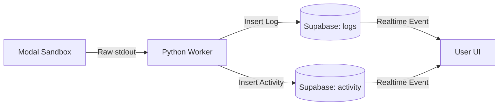

# Buildbox Master Plan: The Autonomous MVP Builder 🏗️

> **Objective**: Build a system where AI agents work like a real engineering team (Planner, Architect, Developer, QA) to build software autonomously.
> **Core Tech**: Python (Orchestrator), Modal (Sandboxes), RabbitMQ (Queues), S3 (Persistence).

---

## Phase 0: Discovery & Strategy (The Agency Start) 🕵️‍♂️

**Goal**: Act like a Product Manager & Brand Strategist. Turn a raw idea into a polished product concept.

### Step 0.1: Market Research Agent
*   **Action**: Create `agents/definitions/researcher.py`.
*   **Tools**: `search_web`, `read_url`.
*   **Task**: "Analyze competitors for [Idea]. Identify gaps and opportunities."

### Step 0.2: Brand Identity Agent
*   **Action**: Create `agents/definitions/brand_strategist.py`.
*   **Tools**: `generate_image` (for logo concepts), `write_file`.
*   **Task**: "Define color palette, typography, voice, and generate a logo concept."

### Step 0.3: The PRD (Product Requirements Document)
*   **Action**: The **Planner Agent** takes the research + brand info.
*   **Output**: A comprehensive `PRD.md` that includes:
    *   User Personas
    *   Core Features (MVP scope)
    *   Brand Guidelines
    *   Success Metrics

---

## Phase 1: The Foundation (Setup & Config) 🛠️

**Goal**: Get the environment ready and the basic "Brain" (Orchestrator) running.

### Step 1.1: Project Skeleton
Create the directory structure defined in `project-structure.md`.
```bash
mkdir -p buildbox/{api,orchestrator,agents,context_engine,sandbox,database}
touch buildbox/config.py
```

### Step 1.2: Database & Queues
*   **PostgreSQL**: Set up tables for `Projects`, `Tasks`, `ContextSnapshots`.
*   **RabbitMQ**: Ensure it's running (locally or cloud).
*   **S3**: Create a bucket `buildbox-backups` for git snapshots.

### Step 1.3: The Orchestrator (Brain)
*   **Action**: Copy `spark-api/workflow/workflow_orchestrator.py` to `buildbox/orchestrator/engine.py`.
*   **Modify**: Rename class to `AgentOrchestrator`.
*   **Implement**: `create_task()` to insert into DB and push to RabbitMQ.

---

## Phase 2: The Environment (Modal Sandbox) 📦

**Goal**: Create the "Computer" where agents will work.

### Step 2.1: The Modal App (`sandbox/modal_env.py`)
Define the persistent volume and the container image.
```python
import modal

app = modal.App("buildbox-sandbox")
volume = modal.Volume.from_name("buildbox-projects", create_if_missing=True)
image = modal.Image.debian_slim().apt_install("git", "nodejs", "npm", "tar")
```

### Step 2.2: The Git Engine
Implement the "Cloned Workspace" logic inside the Modal class.
*   `init_repo(project_id)`: Runs `git init --bare` on the Volume.
*   `clone_repo(project_id)`: Runs `git clone /vol/repos/{id} /workspace` in the Container.
*   `sync_to_s3(project_id)`: Tarballs the repo and uploads to S3.

### Step 2.3: The Validation Loop (Lovable Port)
Port the error parsing logic from Lovable.
*   Implement `run_build_validation()`:
    1.  `npm install`
    2.  `tsc --noEmit`
    3.  `npm run build`
*   **Crucial**: Return structured JSON errors (File, Line, Message).

---

## Phase 3: The Workers (Agents) 👷

**Goal**: Create the agents that actually do the work.

### Step 3.1: The Agent Runner (`agents/runner.py`)
*   **Action**: Copy `spark-api/worker.py`.
*   **Modify**: Update `process_message` to:
    1.  Instantiate `ProjectSandbox` (Modal).
    2.  Call `agent.run(context, sandbox)`.

### Step 3.2: The Developer Agent (`agents/definitions/developer.py`)
Implement the ReAct loop:
1.  **Think**: "I need to edit App.tsx".
2.  **Act**: `sandbox.write_file("src/App.tsx", content)`.
3.  **Observe**: `sandbox.run_build_validation()`.
4.  **Loop**: If error, fix it. If success, commit and push.

### Step 3.3: The Planner & Architect
*   **Planner**: Takes user idea → Writes `PRD.md`.
*   **Architect**: Takes PRD → Writes `file_structure.json`.

---

## Phase 4: The Memory (Context Engine) 🧠

**Goal**: Manage the 200k token budget so agents don't get amnesia.

### Step 4.1: Context Manager (`context_engine/manager.py`)
Implement `get_context(task_id)`:
*   **Layer 1**: Always include Project Goal & Current Phase.
*   **Layer 2**: Fetch relevant files using vector search (pgvector).
*   **Layer 3**: Fetch recent error logs from DB.

### Step 4.2: Context Compression
*   Implement a background job that summarizes completed tasks.
*   "Agent A fixed login" -> "Login implemented (verified)".

---

## Phase 5: The Autonomy (Self-Driving) 🚗

**Goal**: Remove the human from the loop.

### Step 5.1: Autonomous Prompting (`orchestrator/prompt_generator.py`)
*   Create a function that uses an LLM to look at the *previous phase output* and generate the *next phase prompt*.
*   Example: "Here is the PRD. Generate a prompt for the Architect to build the file structure."

### Step 5.2: Phase Manager
*   Implement logic to automatically trigger the next phase when the current one is 100% complete.

---

## Phase 6: The Interface (API & UI) 🖥️

**Goal**: Let users see their app being built.

### Step 6.1: FastAPI Endpoints
*   `POST /projects`: Start a new build.
*   `GET /projects/{id}/logs`: Stream agent logs.

### Step 6.2: GitHub Sync
*   Implement the final "Handoff" step:
    *   `git remote add github ...`
    *   `git push github main`

---

## Phase 7: Launch & Growth (The Marketing Agency) 🚀

**Goal**: Don't just build it, sell it.

### Step 7.1: Marketing Asset Agent
*   **Action**: Create `agents/definitions/marketer.py`.
*   **Task**: Generate:
    *   Landing Page Copy (based on PRD).
    *   Social Media Posts (Twitter/LinkedIn launch threads).
    *   Email Drip Campaign (Welcome sequence).

### Step 7.2: Documentation Agent
*   **Task**: Write `README.md`, `CONTRIBUTING.md`, and `USER_GUIDE.md`.

### Step 7.3: Deployment
*   **Action**: Deploy the app to Vercel/Netlify (via API) or Modal (as a web endpoint).
*   **Output**: A live URL.

---

## 🚀 Execution Order

1.  **Setup**: Create folders, DB, S3.
2.  **Sandbox**: Build `modal_env.py` and test it manually.
3.  **Orchestrator**: Get the task queue running.
4.  **Agency Agents**: Build Researcher & Brand Strategist (Phase 0).
5.  **Dev Agents**: Build Developer & QA (Phase 3).
6.  **Growth Agents**: Build Marketer (Phase 7).
7.  **Autonomy**: Connect the full loop.

This is the roadmap. If you follow this step-by-step, you will have a fully autonomous software agency.
# Autonomous MVP Builder - Project Structure & Technical Spec

This document outlines the exact file structure, function responsibilities, and system interactions for the **Buildbox** project. It specifically details the integration of **Modal** for the sandbox environment.

---

## 📂 Directory Structure

```text
buildbox/
├── api/                        # FastAPI Backend
│   ├── __init__.py
│   ├── main.py                 # App entry point & routes
│   ├── dependencies.py         # DB & Auth dependencies
│   └── routes/
│       ├── projects.py         # Project creation & status
│       └── webhooks.py         # Github/Modal webhooks
├── orchestrator/               # The "Brain" (from Spark API)
│   ├── __init__.py
│   ├── engine.py               # Main Orchestrator class
│   ├── phase_manager.py        # Manages transition between phases
│   └── prompt_generator.py     # Autonomous prompt generation logic
├── agents/                     # The "Workers" (from Spark API)
│   ├── __init__.py
│   ├── runner.py               # RabbitMQ consumer & agent runtime
│   ├── definitions/            # Agent personas
│   │   ├── planner.py
│   │   ├── architect.py
│   │   ├── developer.py
│   │   └── qa.py
│   └── tools/                  # Agent capabilities
│       ├── git_tools.py
│       └── code_tools.py
├── context_engine/             # The "Memory" (New)
│   ├── __init__.py
│   ├── manager.py              # Main context interface
│   ├── retrieval.py            # Vector search logic
│   └── compression.py          # Summarization logic
├── sandbox/                    # The "Environment" (Modal Integration)
│   ├── __init__.py
│   ├── client.py               # Python client to talk to Modal
│   └── modal_env.py            # The actual Modal App definition
├── database/                   # Data Access
│   ├── __init__.py
│   ├── models.py               # SQLAlchemy/Pydantic models
│   └── repository.py           # DB operations
└── config.py                   # Environment configuration
```

---

## 🛠️ Detailed Component Specifications

### 1. API Layer (`api/`)

**`api/main.py`**
*   **Functionality**: Initializes FastAPI, CORS, and DB connections.
*   **Endpoints**:
    *   `GET /health`: System health check.

**`api/routes/projects.py`**
*   **`POST /projects`**
    *   **Input**: `{"idea": "A todo app for astronauts"}`
    *   **Logic**: Creates a DB record, initializes the **Context Engine**, and queues the first task (Planning) to RabbitMQ.
    *   **Output**: `{"project_id": "uuid", "status": "planning"}`
*   **`GET /projects/{id}/status` (SSE)**
    *   **Functionality**: Server-Sent Events stream.
    *   **Logic**: Subscribes to Redis/Postgres notifications to stream real-time logs: "Agent Developer 1 is fixing a bug...", "Sandbox build failed...", etc.

**`api/routes/webhooks.py`**
*   **`POST /webhooks/github`**
    *   **Functionality**: Receives push/PR events.
    *   **Logic**: When a PR is opened/updated, notifies the Orchestrator to spawn a QA Agent.

---

### 2. Orchestrator (`orchestrator/`)

**`orchestrator/engine.py`** (Adapted from `spark-api/workflow_orchestrator.py`)
*   **Class `AgentOrchestrator`**:
    *   `create_task(phase, agent_type, context)`: Inserts task into DB and publishes to RabbitMQ.
    *   `handle_task_completion(task_id, result)`: Called when an agent finishes. Triggers `phase_manager.check_phase_completion()`.

**`orchestrator/phase_manager.py`**
*   **Class `PhaseManager`**:
    *   `check_phase_completion(project_id)`: Checks if all tasks in current phase are done.
    *   `advance_phase(project_id)`: Moves from Dev → QA. Calls `prompt_generator`.

**`orchestrator/prompt_generator.py`**
*   **Function `generate_next_prompt(context)`**:
    *   **Logic**: Uses LLM to look at the *output* of the previous phase (e.g., "PRD created") and the *goal* of the next phase (e.g., "Build Architecture") to generate the specific instructions for the next agents. **This replaces the human.**

---

### 3. Agents (`agents/`)

**`agents/runner.py`** (Adapted from `spark-api/worker.py`)
*   **Function `process_message(msg)`**:
    *   **Logic**:
        1.  Decodes RabbitMQ message (Task ID, Agent Type).
        2.  **Context Loading**: Calls `context_engine.get_context(task_id)`.
        3.  **Sandbox Init**: Calls `sandbox.client.get_sandbox(project_id)`.
        4.  **Execution**: Runs the agent loop (Think → Tool → Think).
        5.  **Reporting**: Sends result back to Orchestrator.

**`agents/definitions/developer.py`**
*   **Function `run(context, sandbox)`**:
    *   The main ReAct loop for a developer.
    *   Has access to `sandbox.run_command`, `sandbox.write_file`.

---

### 4. Sandbox (`sandbox/`) - **MODAL INTEGRATION** 🚀

**`sandbox/modal_env.py`** (The Remote Environment)
*   **Functionality**: Defines the persistent environment where code lives and runs.
*   **Code Structure**:
    ```python
    import modal

    app = modal.App("buildbox-sandbox")
    # Persistent storage for project files
    volume = modal.Volume.from_name("buildbox-projects", create_if_missing=True)

    # The image includes all dev tools (Node, Python, Git, etc.)
    image = modal.Image.debian_slim().apt_install("git", "nodejs", "npm")

    @app.cls(image=image, volumes={"/projects": volume}, timeout=600)
    class ProjectSandbox:
        def __init__(self, project_id: str):
            self.project_path = f"/projects/{project_id}"

        @modal.method()
        def run_command(self, command: str):
            # Runs shell command in project dir
            # Captures stdout/stderr/exit_code
            return result

        @modal.method()
        def write_file(self, path: str, content: str):
            # Writes file to volume
            return success

        @modal.method()
        def read_file(self, path: str):
            # Reads file from volume
            return content
            
        @modal.method()
        def run_build_validation(self):
            # Runs the Lovable-style validation sequence
            # 1. npm install
            # 2. tsc --noEmit
            # 3. npm run build
            # Returns structured error object
            return validation_result
    ```

**`sandbox/client.py`** (The Local Interface)
*   **Class `SandboxClient`**:
    *   `get_sandbox(project_id)`: Returns a handle to the Modal class instance.
    *   `execute_tool(tool_name, args)`: Maps agent tool calls to Modal methods.

---

### 5. Context Engine (`context_engine/`)

**`context_engine/manager.py`**
*   **Class `ContextManager`**:
    *   `get_context(task_id)`:
        1.  Fetches **Core Context** (Project Goal, Current Phase).
        2.  Fetches **Relevant Files** (via `retrieval.py`).
        3.  Fetches **Recent Errors** (from DB).
        4.  Combines and truncates to fit token budget.

**`context_engine/retrieval.py`**
*   **Functionality**: Uses embeddings (pgvector) to find code snippets relevant to the current task description.

---

## 🔄 System Flow Example

1.  **User** POSTs idea to `/api/projects`.
2.  **API** creates Project ID `123`, inits `ContextManager`, queues "Planning Task".
3.  **Agent Runner** picks up Planning Task.
    *   Spawns `PlannerAgent`.
    *   Agent generates PRD.
    *   Agent calls `context_engine.save_artifact("PRD.md")`.
4.  **Orchestrator** sees Planning Task complete.
    *   Calls `prompt_generator` → "Create architecture based on PRD".
    *   Queues "Architecture Task".
5.  **Agent Runner** picks up Architecture Task.
    *   Spawns `ArchitectAgent`.
    *   Agent generates `file_structure.json`.
6.  **Orchestrator** sees Architecture complete.
    *   Splits work into 3 "Dev Tasks".
    *   Queues them.
7.  **Agent Runner** (x3) picks up Dev Tasks.
    *   **Sandbox**: Each agent initializes `ProjectSandbox("123")` on Modal.
    *   **Action**: Agent A calls `sandbox.write_file("src/App.tsx")`.
    *   **Modal**: Writes file to persistent Volume.
    *   **Validation**: Agent A calls `sandbox.run_build_validation()`.
    *   **Modal**: Runs `npm run build`, returns error "Missing module 'react'".
    *   **Auto-Fix**: Agent A sees error, calls `sandbox.run_command("npm install react")`.
8.  **Completion**: All agents finish, Orchestrator triggers Deployment.

---

## 📡 Webhooks & Events

*   **Modal Webhooks**: Not strictly necessary if using `modal.method()` as it returns results directly. However, for long-running builds (deployment), we can use an async pattern where Modal calls back to `/webhooks/modal` upon completion.
*   **GitHub Webhooks**: Essential if we are pushing to a real remote repo. The `DevOps` agent will configure the repo to send events to `/webhooks/github` so the Orchestrator knows when PRs are merged.
# Git Workflow Strategy: Lovable vs. Buildbox

This document explains how Lovable handles version control and proposes a more efficient, multi-agent workflow for Buildbox using Modal.

---

## 1. How Lovable Does It (The "Default")

Lovable treats the sandbox as **ephemeral** (temporary). It doesn't trust the sandbox to keep files safe.

### The Flow
1.  **Start**: When you open a project, Lovable downloads the *entire* latest commit from GitHub/S3.
2.  **Upload**: It uploads these files to a fresh sandbox instance.
3.  **Edit**: When the AI writes code, it modifies files in the sandbox.
4.  **Commit**:
    *   Lovable takes the changes.
    *   Creates a new Commit object *externally* (via GitHub API or S3 manipulation).
    *   Pushes that commit to the remote repo.
5.  **Loop**: For the next edit, it repeats the process.

### ⚠️ The Limitation for Us
*   **Single Threaded**: It assumes one user (or one agent) is working linearly on `main`.
*   **Slow Context Switching**: Switching branches means re-downloading and re-uploading everything.
*   **No "Real" Git**: The sandbox doesn't usually run `git` commands; the API handles the git logic.

---

## 2. The Buildbox Strategy: "Cloned Workspaces" (True Isolation)

You are absolutely right—having agents share the same working directory would cause conflicts (file locks, overwrites, build artifacts).

Instead, we will mimic a real engineering team exactly:

*   **The "Origin" (Shared Volume)**: This acts like GitHub. It holds the **Bare Git Repository**. No one works directly here.
*   **The "Laptop" (Agent Container)**: Each agent gets a **fresh, isolated container**. They `git clone` from the Volume into their container.

### 🏗️ Architecture

1.  **Central Storage (Modal Volume)**
    *   Path: `/vol/repos/project-123.git` (Bare Repo)
    *   Role: The "Remote Origin". Stores the history and branches.

2.  **Agent A's Environment (Container 1)**
    *   **Action**: Starts up, runs `git clone /vol/repos/project-123.git /workspace`
    *   **Work**: Edits files in `/workspace`. Runs `npm install`, `npm test` here.
    *   **Isolation**: Uses its own CPU/RAM and ephemeral disk. **Zero conflicts** with Agent B.
    *   **Sync**: Runs `git push origin feature/login` to send changes back to the Volume.

3.  **Agent B's Environment (Container 2)**
    *   **Action**: Starts up, runs `git clone /vol/repos/project-123.git /workspace`
    *   **Work**: Totally separate copy of the files.
    *   **Sync**: Pushes `feature/dashboard` to the Volume.

### 🔄 The Multi-Agent Workflow

#### Step 1: Initialization (Orchestrator)
1.  Creates Modal Volume.
2.  Runs `git init --bare /vol/repos/project-123.git`.

#### Step 2: Parallel Development
*   **Agent A** (Feature: Login)
    1.  Spawns new Container.
    2.  Clones repo.
    3.  Checks out `feature/login`.
    4.  **Builds & Tests locally** (safe!).
    5.  Pushes to Volume.

*   **Agent B** (Feature: Dashboard)
    1.  Spawns new Container.
    2.  Clones repo.
    3.  Checks out `feature/dashboard`.
    4.  **Builds & Tests locally** (safe!).
    5.  Pushes to Volume.

#### Step 3: Merge (Orchestrator)
1.  Spawns Container.
2.  Clones repo.
3.  Merges `feature/login` and `feature/dashboard` into `main`.
4.  Pushes result back to Volume (and optionally to GitHub).

### ✅ Why This is Better
1.  **True Isolation**: Agent A can delete their `node_modules` and it won't hurt Agent B.
2.  **No File Locking**: `npm install` won't fail because another agent is writing to the disk.
3.  **Standard Git Flow**: It works *exactly* like a distributed team. The Volume is just a very fast, local GitHub.

---

## 3. Implementation Details

### `sandbox/modal_env.py`

```python
import modal

app = modal.App("buildbox-sandbox")
volume = modal.Volume.from_name("buildbox-projects", create_if_missing=True)

@app.cls(volumes={"/projects": volume})
class ProjectSandbox:
    def __init__(self, project_id: str):
        self.repo_path = f"/projects/{project_id}"

    @modal.method()
    def run_git_command(self, args: list[str]):
        # e.g. ["checkout", "-b", "feature/login"]
        return subprocess.run(["git"] + args, cwd=self.repo_path, ...)
```

### FAQ

**Q: Do agents need separate Modals?**
A: Yes, they need separate *containers* (Sandboxes) so their running processes (like a dev server or test runner) don't conflict. But they share the same *file system* (Volume).

**Q: What if two agents edit the same file?**
A: Git handles this! Just like humans. If Agent A and Agent B edit `App.tsx`, the one who merges second will have to resolve conflicts (or the Orchestrator will detect the conflict during merge).

**Q: How does the QA agent know what to check?**
A: The Developer Agent sends a message: "I finished task #101 on branch `feature/login`". The Orchestrator forwards this to QA.

---

## 4. The Safety Layer (S3 Backup) 🛡️

You are absolutely right. We should treat Modal Volumes as reliable but not invincible. And we want to avoid GitHub rate limits entirely during the build.

**The Solution: S3 Snapshots**

1.  **Primary Storage**: Modal Volume (Fast, Local Git).
2.  **Backup Storage**: S3 Bucket (Cheap, Unlimited, No Rate Limits).
3.  **Handoff Storage**: GitHub (Only used at the very end).

### How It Works
*   **Sync Job**: Every time a task completes or a merge happens, the Orchestrator triggers a quick sync:
    ```bash
    # Inside a Modal Container
    tar -czf repo.tar.gz /vol/repos/project-123.git
    aws s3 cp repo.tar.gz s3://buildbox-backups/project-123/latest.tar.gz
    ```
*   **Disaster Recovery**: If the Modal Volume dies, we just:
    1.  Create a new Volume.
    2.  Download the tarball from S3.
    3.  Untar it.
    4.  Resume work.

### ✅ Why This is Best
*   **Zero GitHub Rate Limits**: We don't touch GitHub API until the project is 100% done.
*   **Simple**: It's just moving files. No complex git remote management.
*   **Ephemeral Friendly**: We can destroy the entire Modal environment and restore it perfectly from S3 in seconds.
# Modal Architecture Deep Dive & Lovable Reuse

## 1. The "One Modal" vs. "Many Containers" Confusion

It's easy to get confused by the terminology. Here is the analogy:

*   **Modal App**: Think of this as the **Factory Blueprint**. It defines *how* to build a machine.
*   **Modal Container**: Think of this as the **Actual Machine**. You can build 1,000 machines from one blueprint.

### How It Works for Us

We define **ONE** Modal App (The Blueprint):
```python
# The Blueprint
@app.cls(image=my_image, volumes={"/vol": shared_volume})
class AgentSandbox:
    def run_task(self, task):
        # ...
```

When the Orchestrator needs 3 agents, it calls this blueprint 3 times:
```python
# The Execution
agent1 = AgentSandbox() # Spawns Container 1 (Machine A)
agent2 = AgentSandbox() # Spawns Container 2 (Machine B)
agent3 = AgentSandbox() # Spawns Container 3 (Machine C)
```

*   **Container 1**: Has its own CPU, RAM, and `/tmp` disk. It clones the repo, installs `node_modules`.
*   **Container 2**: Has its *own* CPU, RAM, and `/tmp` disk. It clones the repo, installs *its own* `node_modules`.
*   **Isolation**: If Container 1 crashes or deletes its files, Container 2 is **completely unaffected**.

**So: Yes, they use "One Modal Definition", but they get "Separate Computers" (Containers) at runtime.**

---

## 2. The Detailed Workflow

Here is the exact sequence of events for a **Developer Agent** fixing a bug.

### Phase A: Spin Up 🚀
1.  **Orchestrator** calls `AgentSandbox.remote()`.
2.  **Modal** spins up a fresh Container (takes ~1-2s).
3.  **Container** mounts the Shared Volume at `/vol`.

### Phase B: Setup Workspace 📂
4.  **Agent** runs: `git clone /vol/repos/project.git /workspace`
    *   *Note: This is super fast because it's a local copy from the mounted volume.*
5.  **Agent** runs: `git checkout -b feature/fix-login`
6.  **Agent** runs: `npm install`
    *   *Note: This installs dependencies into `/workspace/node_modules` inside the CONTAINER. It does not touch the Shared Volume.*

### Phase C: The Work Loop (Reusing Lovable!) 🔄
7.  **Agent** writes code to `/workspace/src/Login.tsx`.
8.  **Agent** runs validation (The "Lovable Loop"):
    *   Runs `npm run build`.
    *   **Captures Output**: "Error: 'Button' is not defined".
    *   **Parses Error**: Uses Lovable's regex logic to find the line number.
9.  **Agent** fixes code.
10. **Agent** runs validation again. Success!

### Phase D: Sync Back 💾
11. **Agent** runs: `git add .`
12. **Agent** runs: `git commit -m "Fix login button"`
13. **Agent** runs: `git push origin feature/fix-login`
    *   *Note: This pushes the changes from the Container back to the Shared Volume.*
14. **Container** shuts down.

---

## 3. What We Reuse From Lovable

Since we are using Git for file management, we don't need Lovable's complex "Multipart Upload" system. But we **DO** need their **Validation & Error Intelligence**.

### ✅ 1. Error Parsing Logic
*   **Source**: `lovable/go/api/internal/sandbox/upload.go` (specifically `checkViteLogsForStartErrors`)
*   **Source**: `lovable/app/lib/processRuntimeError.ts`
*   **Usage**: When our agent runs `npm run dev` or `npm run build`, we get a wall of text. We need Lovable's regex patterns to parse this text and extract:
    *   File Name
    *   Line Number
    *   Error Message
*   **Why**: The LLM needs clean error data, not a 500-line log dump.

### ✅ 2. Build Validation Sequence
*   **Source**: `lovable/go/api/internal/sandbox/upload.go` (The `UploadFiles` function logic)
*   **Usage**: Lovable has a specific order of operations that works well:
    1.  `npm install` (Check dependencies)
    2.  `tsc --noEmit` (Check types - fast)
    3.  `vite build` (Check full build - slow)
*   **Why**: We should copy this sequence. Don't try to build if `npm install` failed. Don't try to run if types are broken.

### ✅ 3. Tool Definitions
*   **Source**: `lovable/go/api/internal/providers/tools.go`
*   **Usage**: The way they define tools for the LLM is excellent.
    *   `read_file`: "Read lines 1-50 of file X"
    *   `search_replace`: "Replace code block A with B"
*   **Why**: We can port these definitions to Python almost 1:1. They are proven to work well with Claude/GPT-4.

### ❌ What We DROP
*   **The "Upload" Endpoint**: We use `git pull` instead.
*   **The "Streaming JSON" Response**: We can just return the result of the function call directly since Modal handles the RPC.

---

## Summary

1.  **Architecture**: One Blueprint (Modal App) → Many Isolated Machines (Containers).
2.  **Workflow**: Clone from Volume → Work in Container → Push to Volume.
3.  **Reuse**: Keep Lovable's **Brain** (Error Parsing, Validation Logic, Tool Defs) but replace its **Body** (File Uploads) with Git.
# Real-Time Updates Strategy: The "Pulse" of Buildbox 💓

This document defines how we stream updates to the user. We distinguish between **High-Level Milestones** (what the user cares about) and **Low-Level Logs** (what developers care about).

---

## 1. The Two Streams

We don't just dump text. We provide two distinct experiences.

### Stream A: The Activity Feed (Milestones) 🏆
*   **Audience**: The Founder/User.
*   **Content**: Human-readable, emoji-rich updates about progress.
*   **Examples**:
    *   "🎨 **Design Agent** created the initial homepage mockup."
    *   "🏗️ **Architect Agent** defined the database schema."
    *   "✅ **QA Agent** passed all tests for the Login feature."
    *   "🚀 **DevOps Agent** deployed the staging URL."

### Stream B: The Terminal (Raw Logs) 💻
*   **Audience**: The Debugger / Curious User.
*   **Content**: Raw `stdout` from the Modal Sandbox.
*   **Examples**:
    *   `> npm install react-router-dom`
    *   `[vite] connecting...`
    *   `TypeScript error: Property 'user' does not exist on type 'Request'.`

---

## 2. Architecture: The "Relay" Pattern

We use the **Python Worker** as the central broadcaster. The Sandbox is dumb; it just runs commands. The Worker adds the context.



---

## 3. Database Schema (Supabase)

We need two tables to handle these streams.

### Table 1: `project_activity` (The Feed)
| Column | Type | Description |
| :--- | :--- | :--- |
| `id` | uuid | Primary Key |
| `project_id` | uuid | Foreign Key |
| `agent_role` | text | "Designer", "Architect", "Developer" |
| `message` | text | "Created homepage mockup" |
| `metadata` | jsonb | `{ "file_path": "src/Home.tsx", "screenshot_url": "..." }` |
| `created_at` | timestamp | |

### Table 2: `project_logs` (The Terminal)
| Column | Type | Description |
| :--- | :--- | :--- |
| `id` | uuid | Primary Key |
| `project_id` | uuid | Foreign Key |
| `command` | text | "npm install" |
| `content` | text | The raw output chunk |
| `type` | text | "stdout" or "stderr" |
| `created_at` | timestamp | |

---

## 4. Implementation Details

### How the Worker Sends Updates

```python
# agents/runner.py

class AgentRunner:
    def run_agent_task(self, agent, task):
        # 1. Notify User: Task Started
        self.broadcast_activity(
            role=agent.role, 
            message=f"Starting task: {task.name}",
            metadata={"status": "started"}
        )

        # 2. Run the logic (with raw logs)
        self.run_command_in_sandbox("npm install")

        # 3. Notify User: Task Complete
        self.broadcast_activity(
            role=agent.role,
            message=f"Completed task: {task.name}",
            metadata={"status": "completed", "artifacts": ["App.tsx"]}
        )

    def broadcast_activity(self, role, message, metadata):
        supabase.table("project_activity").insert({
            "project_id": self.project_id,
            "agent_role": role,
            "message": message,
            "metadata": metadata
        }).execute()

    def run_command_in_sandbox(self, cmd):
        # Stream raw logs
        for chunk in sandbox.run.remote_gen(cmd):
            supabase.table("project_logs").insert({
                "project_id": self.project_id,
                "content": chunk,
                "type": "stdout"
            }).execute()
```

### How the Frontend Receives Updates

The frontend subscribes to both tables using Supabase Realtime.

```typescript
// hooks/useProjectUpdates.ts

// 1. Listen for Milestones
supabase
  .channel('activity')
  .on('postgres_changes', { event: 'INSERT', table: 'project_activity' }, (payload) => {
    showNotification(`${payload.new.agent_role}: ${payload.new.message}`);
    updateFeed(payload.new);
  })
  .subscribe();

// 2. Listen for Logs (Terminal)
supabase
  .channel('logs')
  .on('postgres_changes', { event: 'INSERT', table: 'project_logs' }, (payload) => {
    appendToTerminal(payload.new.content);
  })
  .subscribe();
```

---

## 5. Summary

*   **Milestones**: "Designer created X". Stored in `project_activity`.
*   **Logs**: "npm install...". Stored in `project_logs`.
*   **Mechanism**: Worker inserts to DB -> Supabase pushes to UI.
*   **Benefit**: Users get the high-level story, but can drill down into the matrix code if they want.
# The Buildbox Journey: From Brief to Launch 🚀

This document maps the exact flow of a project from the moment a client signs up to the moment their app is live.

---

## Stage 1: The "Handshake" (Input) 🤝
**Trigger**: User submits a "Project Brief" (1-2 paragraphs describing their idea).

1.  **User Action**: Enters "I want a Tinder for Dog Walkers" into the dashboard.
2.  **System Action**: Creates a new Project ID.
3.  **Orchestrator**: Spins up the **Phase 0 (Discovery)** agents.

---

## Stage 2: The Strategy (Phase 0) 🧠
**Goal**: Turn a vague idea into a concrete plan.

1.  **Researcher Agent**:
    *   *Action*: Googles "Dog walking apps", "Rover competitors".
    *   *Output*: `market_analysis.md` (Identifies gaps: "No app focuses on social connection between owners").
2.  **Brand Agent**:
    *   *Action*: Generates name ideas ("PawPal", "Walkie"). Generates logo concepts.
    *   *Output*: `brand_identity.md` (Color palette: Orange/Teal, Tone: Friendly).
3.  **Planner Agent**:
    *   *Action*: Reads the brief + research + brand.
    *   *Output*: **The PRD (Product Requirements Document)**.
        *   "User can swipe left/right on walkers."
        *   "User can chat."
        *   "Stripe subscription for premium."

**✨ User Experience**: The user gets a notification: *"Your Strategy Plan is ready."* They see the PRD and Logo. They click **"Approve"**.

---

## Stage 3: The Blueprint (Phase 1) 📐
**Goal**: Define the technical architecture.

1.  **Architect Agent**:
    *   *Input*: PRD.
    *   *Action*: Decides stack (React, Node, Postgres). Defines DB Schema (`users`, `dogs`, `matches`).
    *   *Output*: `file_structure.json` and `schema.sql`.

---

## Stage 4: The Build (Phase 2-5) 🏗️
**Goal**: Write the code.

1.  **Orchestrator**: Breaks the PRD into tasks.
    *   Task 1: "Setup Auth"
    *   Task 2: "Build Swipe UI"
    *   Task 3: "Build Chat Backend"
2.  **Developer Agent (The Loop)**:
    *   *Action*: Picks up Task 1.
    *   *Work*: Clones repo -> Writes code -> Runs tests -> Fixes errors.
    *   *Result*: Pushes `feature/auth` to Modal Volume.
3.  **QA Agent**:
    *   *Action*: Pulls `feature/auth`. Runs integration tests.
    *   *Result*: "Approved".
4.  **Orchestrator**: Merges to `main`.

**✨ User Experience**: The user watches the **Activity Feed** populate in real-time.
*   "🎨 Design Agent created Login Screen" (shows screenshot)
*   "✅ QA Agent verified Payment Flow"

---

## Stage 5: The Launch (Phase 6-7) 🚀
**Goal**: Go live and get users.

1.  **DevOps Agent**:
    *   *Action*: Deploys the final code to Vercel/Railway.
    *   *Output*: `https://pawpal-app.com`
2.  **Marketer Agent**:
    *   *Action*: Reads the PRD and the final app features.
    *   *Output*:
        *   Landing Page Copy ("Find your dog's best friend").
        *   3 Twitter Threads for launch day.
        *   Welcome Email sequence for new users.

---

## Stage 6: The Handoff 🎁
**Trigger**: Project is 100% complete.

1.  **System Action**:
    *   Pushes code to the User's GitHub.
    *   Sends an email: "Your MVP is ready."
2.  **User Action**:
    *   Logs in to their new app.
    *   Starts posting the marketing content.

---

## Summary Timeline (The "24 Hour" Promise)

| Time | Phase | Activity |
| :--- | :--- | :--- |
| **00:00** | **Brief** | User submits idea. |
| **00:30** | **Strategy** | Research & PRD generated. User approves. |
| **01:00** | **Blueprint** | DB Schema & Architecture defined. |
| **01:30** | **Dev Starts** | Agents begin coding features in parallel. |
| **12:00** | **Mid-Point** | Core features (Auth, DB, UI) complete. |
| **20:00** | **QA & Polish** | Bug fixing and UI refinement. |
| **23:00** | **Marketing** | Launch assets generated. |
| **24:00** | **Launch** | App deployed. Keys handed over. |
